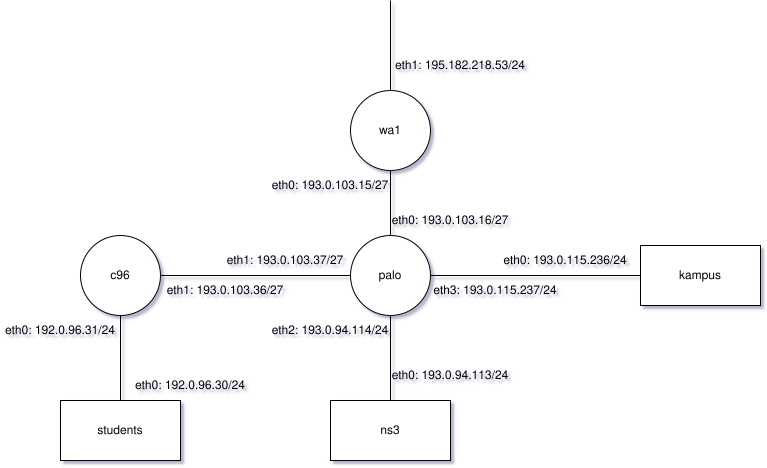

# Zadanie 3

## Autor

Marcin Szopa 459531

## a)



## b)

```bash
traceroute c96.mimuw.edu.pl
traceroute to c96.mimuw.edu.pl (193.0.103.36), 30 hops max, 60 byte packets
 1  palo.uw.edu.pl (193.0.94.114)
 2  c96.mimuw.edu.pl (193.0.103.36)
```

## c)

### Tabela trasowania (routing table)

| Sieć docelowa    | Maska podsieci     | Brama (Gateway)      | Interfejs      |
|------------------|--------------------|----------------------|----------------|
| 193.0.103.0      | 255.255.255.224    | 0.0.0.0              | eth0           |
| 193.0.103.32     | 255.255.255.224    | 0.0.0.0              | eth1           |
| 193.0.94.0       | 255.255.255.0      | 0.0.0.0              | eth2           |
| 193.0.115.0      | 255.255.255.0      | 0.0.0.0              | eth3           |
| 195.182.218.0    | 255.255.255.0      | 193.0.103.15         | eth0           |
| 192.0.96.0       | 255.255.255.0      | 193.0.103.36         | eth1           |
| 0.0.0.0          | 0.0.0.0            | 193.0.103.1          | eth0           |

## d)

```dns
$TTL 86400 ; 1d

uw.edu.pl. IN SOA ns3.uw.edu.pl. dns.adm.uw.edu.pl. (
2025060712 ; numer seryjny
2600 ; odświeżanie 6h
1200 ; ponawianie 20min
604800 ; wygasanie 1w
7200 ; negatywne buforowanie 2h
)

IN NS ns3.mimuw.edu.pl.

ns3 IN A 193.0.94.113

palo IN A 193.0.103.37
palo IN A 193.0.94.114
palo IN A 193.0.115.237
palo IN A 193.0.103.16

kampus IN A 193.0.115.236
```

### Wyjaśnienie

*nie wiedziałem co wpisać jako authority*, więc wpisałem `dns.adm.uw.edu.pl.` w związku z:

```bash
mszopa@DESKTOP-GJN9N48:/mnt/c/Users/marci$ dig palo.uw.edu.pl
...
;; AUTHORITY SECTION:
uw.edu.pl.              1800    IN      SOA     ns3.uw.edu.pl. dns.adm.uw.edu.pl. 2025052302 14400 3600 2419200 86400
```
